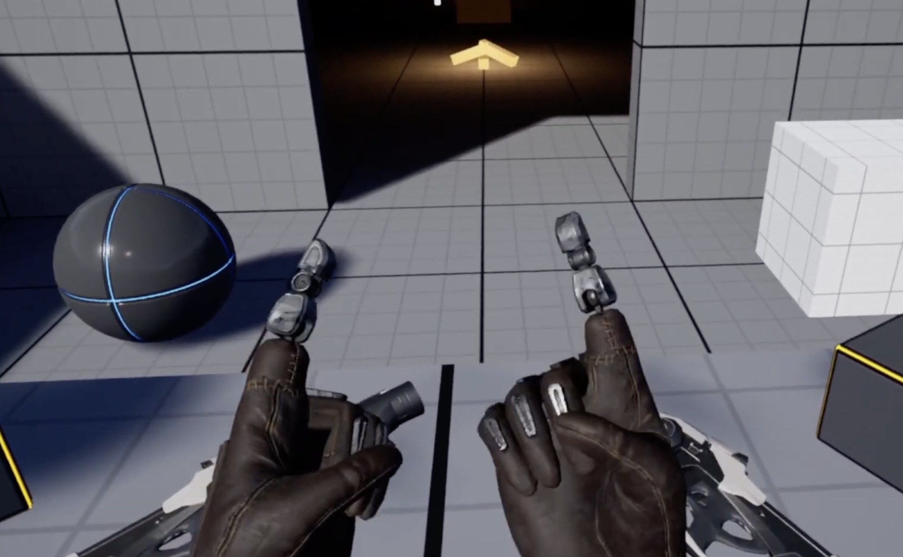

z1 studio est un studio de création basé à Genève, actif à la croisée de l'art, des technologies numériques et des expériences interactives. Le studio développe des installations, performances et expériences immersives mêlant notamment création 3D temps réel, réalité virtuelle, lumière, son et interaction.

Comment permettre à une application interactive de comprendre les gestes de son utilisateur ?

Lever les mains, les joindre, former un récipient avec ses paumes, pointer quelque chose, saisir un objet imaginaire ou réaliser une succession de mouvements : nos mains constituent un moyen d'interaction particulièrement riche et intuitif.

Ce projet propose d'explorer la reconnaissance de poses et de gestes des mains dans Unreal Engine, afin d'imaginer de nouvelles manières d'interagir avec un environnement virtuel.

Le système pourra être utilisé en réalité virtuelle, grâce au suivi des mains directement réalisé par un casque VR, mais également avec d'autres dispositifs de capture de mouvement, notamment des gants de tracking tels que les [Rokoko Smartgloves](https://www.rokoko.com/products/smartgloves-ii) ou les [MANUS Metagloves](https://www.manus-meta.com/products/metagloves-pro).

L'enjeu sera ainsi de réfléchir à un système suffisamment générique pour reconnaître un geste indépendamment de la technologie utilisée pour capturer le mouvement.

## Reconnaître une pose

Une première partie du projet consistera à permettre à l'application de reconnaître une pose de référence.

Comment déterminer qu'une main ouverte, un poing fermé ou une configuration plus complexe des doigts correspond suffisamment à une pose définie auparavant ?

Les étudiants pourront explorer différentes manières de représenter et comparer ces poses : positions et orientations des articulations, distances, angles, vecteurs, scores de similarité, seuils de tolérance, etc.

L'objectif sera également de concevoir un moyen simple et visuel pour un utilisateur de créer une bibliothèque d'assets de poses de référence directement dans Unreal Engine.

## De la pose au geste

Un geste introduit une nouvelle dimension : le temps.

Un mouvement peut être constitué d'une trajectoire, d'un changement d'orientation ou encore d'un enchaînement de plusieurs poses.

Par exemple, un utilisateur pourrait joindre ses deux mains comme pour recueillir de l'eau, les rapprocher de son visage puis les incliner pour boire.

Comment décrire ce geste ? Comment déterminer son début et sa fin ? Quelle liberté laisser à l'utilisateur dans son exécution ? Comment distinguer deux gestes similaires ?

Le projet permettra d'expérimenter différentes approches pour construire progressivement un vocabulaire gestuel utilisable dans une application interactive.

## Programmation dans Unreal Engine

Le projet constitue une occasion de découvrir la programmation dans Unreal Engine à travers un problème concret.

Les étudiants pourront travailler avec Blueprint et C++, manipuler des transformations et des vecteurs 3D, développer des algorithmes de comparaison, gérer des données en temps réel et concevoir leurs propres composants et outils à l'intérieur du moteur.

## Animation et représentation du corps en 3D

Travailler avec les mouvements des mains sera également l'occasion de découvrir plusieurs notions fondamentales de l'animation 3D temps réel.

Les étudiants seront amenés à comprendre comment est représentée une main virtuelle : Skeletal Mesh, squelette, bones, articulations, hiérarchies, transformations locales et globales, rigging, poses et animation.

Ils pourront ainsi faire le lien entre les données provenant d'un corps réel et la manière dont celles-ci sont représentées et animées sur un personnage ou une main virtuelle.

## UX et création d'outils

Reconnaître correctement un geste d'un point de vue mathématique ne suffit pas nécessairement à créer une bonne interaction.

Quelle précision demander à l'utilisateur ? Combien de temps doit-il maintenir une pose ? Comment lui indiquer que son geste est en train d'être reconnu ? Comment éviter qu'un geste soit déclenché accidentellement ?

Une partie du projet concernera donc l'UX et le design d'interaction, avec une approche basée sur l'expérimentation et les tests.

Le projet comportera également une réflexion sur le workflow de création : comment permettre à un designer de créer une nouvelle pose ou un nouveau geste, de le tester, d'ajuster sa tolérance puis de l'utiliser dans une expérience sans avoir à modifier l'algorithme de reconnaissance ?

Cette réflexion pourra mener à la réalisation de petits outils intégrés à Unreal Engine, transformant progressivement le prototype en un système réellement utilisable par d'autres créateurs.

## Objectif

À terme, l'ambition est de disposer d'un prototype de système de reconnaissance de poses et de gestes réutilisable dans Unreal Engine, capable de fonctionner avec différentes sources de capture des mains.

Au-delà du résultat technique, le projet est surtout l'occasion d'aborder de manière très concrète plusieurs domaines qui se rencontrent aujourd'hui dans la création d'expériences interactives : programmation, mathématiques 3D, animation, capture de mouvement, UX, réalité virtuelle et développement d'outils.

## Ressources mises à disposition

Un projet template Unreal Engine fonctionnel sera fourni aux étudiants afin qu'ils puissent se concentrer directement sur la problématique de reconnaissance de poses et de gestes.

Ce projet permettra notamment de recevoir et visualiser les données de suivi des mains provenant d'un casque Meta Quest, avec un premier exemple d'interaction simple.

Les étudiants disposeront ainsi dès le départ d'une base fonctionnelle sur laquelle expérimenter, développer et tester leurs propres approches.

## Critères d'évaluation

À définir.
